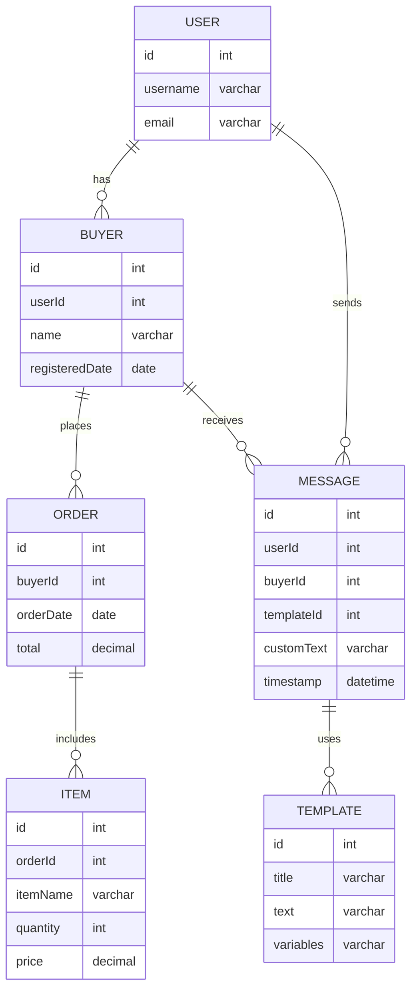

このER図では、`BUYER`と`ORDER`の間に一対多の関係（`places`）が設定されており、一人の`Buyer`が複数の`Order`を持つことができます。各エンティティの属性として、主キー（`id`）、その他の重要な情報（`name`, `email`など）が定義されています。

### ファイルに記述する手順
1. 上記のサンプルコードを新しいMarkdownファイル（例：`database_design.md`）にコピーします。
2. 必要に応じて他のエンティティや関係を追加します。
3. VSCodeなどのエディタでMarkdownプレビューを利用して、図が正しくレンダリングされていることを確認します。
4. ファイルをプロジェクトのリポジトリに追加し、バージョン管理下に置きます。

これで、プロジェクトのドキュメントとしてER図を効果的に活用し、チームメンバーや将来の開発者にも理解しやすい資料を提供することができます。

### 各テーブルと関係の説明

- **USER**:
  - ユーザーは複数のバイヤープロファイル（`Buyer`）を持ち、メッセージ（`Message`）も送信できます。
- **BUYER**:
  - バイヤーは複数の注文（`Order`）を行います。
- **ORDER**:
  - 各注文は複数のアイテム（`Item`）を含みます。
- **ITEM**:
  - アイテムは注文に属しています。例えば、商品名、数量、価格などの情報を持ちます。
- **TEMPLATE**:
  - `id`: テンプレートの一意の識別子（主キー）
  - `title`: テンプレートのタイトル
  - `text`: テンプレート本文（基本形）
  - `variables`: テンプレート内で置換可能な変数（例: ユーザー名、日付など）

- **MESSAGE**:
  - `id`: メッセージの一意の識別子（主キー）
  - `userId`: メッセージを送信したユーザーのID（外部キー）
  - `buyerId`: メッセージを受信したバイヤーのID（外部キー）
  - `templateId`: 使用されたメッセージテンプレートのID（外部キー）
  - `customText`: ユーザーによってカスタマイズされたメッセージテキスト（オプション）
  - `timestamp`: メッセージの送信時間

### メッセージテーブルの検討
`Message` テーブルはユーザーからのコミュニケーションを記録するために使用されます。各メッセージは `User` に紐付けられ、ユーザーがサポートや他のユーザーへのコンタクトにこのテーブルを使うと仮定しています。メッセージがどのトランザクションやアイテムに関連するかを示すために、オプショナルな外部キーを設定することも可能です（例: `orderId`）。ただし、これはビジネスルールに依存します。

### ファイルへの記述と確認
1. 上記の更新されたコードをMarkdownファイルに追記または新規作成します。
2. ファイルを保存し、VSCodeでプレビューを確認して図が正しく表示されているかチェックします。
3. 正しく表示されていることを確認したら、このファイルをプロジェクトのリポジトリにコミットしてバージョン管理します。

これで、プロジェクトのデータ構造がさらに明確化され、開発に必要な情報が一元化されていることが確認できます。