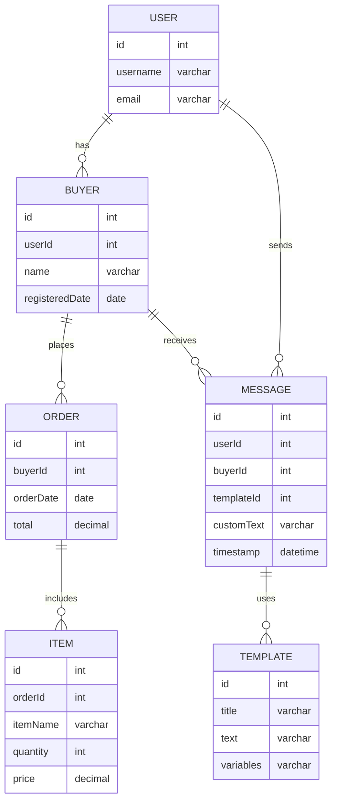

このER図では、`BUYER`と`ORDER`の間に一対多の関係（`places`）が設定されており、一人の`Buyer`が複数の`Order`を持つことができます。各エンティティの属性として、主キー（`id`）、その他の重要な情報（`name`, `email`など）が定義されています。

### ファイルに記述する手順
1. 上記のサンプルコードを新しいMarkdownファイル（例：`database_design.md`）にコピーします。
2. 必要に応じて他のエンティティや関係を追加します。
3. VSCodeなどのエディタでMarkdownプレビューを利用して、図が正しくレンダリングされていることを確認します。
4. ファイルをプロジェクトのリポジトリに追加し、バージョン管理下に置きます。

これで、プロジェクトのドキュメントとしてER図を効果的に活用し、チームメンバーや将来の開発者にも理解しやすい資料を提供することができます。

### 各テーブルと関係の説明

- **USER**:
  - ユーザーは複数のバイヤープロファイル（`Buyer`）を持ち、メッセージ（`Message`）も送信できます。
- **BUYER**:
  - バイヤーは複数の注文（`Order`）を行います。
- **ORDER**:
  - 各注文は複数のアイテム（`Item`）を含みます。
- **ITEM**:
  - アイテムは注文に属しています。例えば、商品名、数量、価格などの情報を持ちます。
- **TEMPLATE**:
  - `id`: テンプレートの一意の識別子（主キー）
  - `title`: テンプレートのタイトル
  - `text`: テンプレート本文（基本形）
  - `variables`: テンプレート内で置換可能な変数（例: ユーザー名、日付など）

- **MESSAGE**:
  - `id`: メッセージの一意の識別子（主キー）
  - `userId`: メッセージを送信したユーザーのID（外部キー）
  - `buyerId`: メッセージを受信したバイヤーのID（外部キー）
  - `templateId`: 使用されたメッセージテンプレートのID（外部キー）
  - `customText`: ユーザーによってカスタマイズされたメッセージテキスト（オプション）
  - `timestamp`: メッセージの送信時間

### メッセージテーブルの検討
`Message` テーブルはユーザーからのコミュニケーションを記録するために使用されます。各メッセージは `User` に紐付けられ、ユーザーがサポートや他のユーザーへのコンタクトにこのテーブルを使うと仮定しています。メッセージがどのトランザクションやアイテムに関連するかを示すために、オプショナルな外部キーを設定することも可能です（例: `orderId`）。ただし、これはビジネスルールに依存します。

### ファイルへの記述と確認
1. 上記の更新されたコードをMarkdownファイルに追記または新規作成します。
2. ファイルを保存し、VSCodeでプレビューを確認して図が正しく表示されているかチェックします。
3. 正しく表示されていることを確認したら、このファイルをプロジェクトのリポジトリにコミットしてバージョン管理します。

これで、プロジェクトのデータ構造がさらに明確化され、開発に必要な情報が一元化されていることが確認できます。
---

## エラー設計（案）

### 目的
- 障害の早期検知（運用が気づける）
- 原因追跡（どの外部API/どのユーザー/どの処理で失敗したか）
- 復旧判断（再試行すべきか、再認証が必要か）

### エラー分類（例）
- `AUTH`: 認証/認可（token失効、権限不足）
- `EXTERNAL`: 外部API（eBay/Ship&Co/Google Sheets）
- `DB`: データベース（タイムアウト、RLS、制約違反）
- `VALIDATION`: 入力不正/必須不足
- `RATE_LIMIT`: レート制限
- `TIMEOUT`: タイムアウト
- `UNKNOWN`: 不明

### 重要度（例）
- `INFO`: 影響なし/リトライで回復
- `WARN`: 一部失敗/手動確認推奨
- `ERROR`: 機能停止/ユーザー影響あり
- `CRITICAL`: 全体停止/即時対応

### 再試行ポリシー（例）
- `AUTH`: 原則リトライしない。再認証が必要（ユーザー通知）
- `EXTERNAL`/`TIMEOUT`/`RATE_LIMIT`: 指数バックオフで再試行
- `DB`: 一時的なら再試行、恒常なら運用対応
- `VALIDATION`: 再試行しない（入力修正）

### 記録する基本フィールド（案）
- `error_code`（例: `EBAY_AUTH_INVALID`, `SHIPCO_TIMEOUT`）
- `category`（上記の分類）
- `severity`
- `provider`（`ebay`, `shipco`, `sheets`, `supabase` など）
- `user_id`, `account_id`, `order_id`（必要に応じて）
- `request_id` / `job_id`（同期処理の単位）
- `message`（人が読む用の短文）
- `payload_summary`（機密を避けた要約）
- `retryable`（true/false）
- `occurred_at`

### このシステム向けの前提/優先度
- eBay token失効: `AUTH` + `ERROR` + `retryable=false` で記録し、管理画面/通知に出す
- 注文同期・商品同期の失敗: `EXTERNAL` or `DB` として記録
- 画面側は「同期失敗の原因を見せる」より「再認証が必要/再試行が必要」の判断に寄せる

### 今後の実装ステップ（順序）
1. エラーテーブル追加（`errors` or `system_errors`）
2. 主要APIで記録（同期/更新系）
3. 管理UIで一覧表示 + 重要エラーのバナー表示

---

## エラーテーブル設計（案）

### テーブル名
- `system_errors`

### カラム
- `id` bigserial primary key
- `created_at` timestamptz not null default now()
- `error_code` text not null
- `category` text not null
- `severity` text not null
- `provider` text not null
- `message` text not null
- `retryable` boolean not null default false
- `user_id` bigint null
- `account_id` bigint null
- `order_id` bigint null
- `job_id` uuid null
- `request_id` text null
- `payload_summary` jsonb null
- `details` jsonb null

### インデックス
- `created_at`（時系列取得）
- `user_id, created_at`（ユーザー別の直近エラー）
- `account_id, created_at`（アカウント別）
- `error_code, created_at`（特定エラー監視）

### SQL（Postgres）
```sql
create table if not exists system_errors (
  id bigserial primary key,
  created_at timestamptz not null default now(),
  error_code text not null,
  category text not null,
  severity text not null,
  provider text not null,
  message text not null,
  retryable boolean not null default false,
  user_id bigint null,
  account_id bigint null,
  order_id bigint null,
  job_id uuid null,
  request_id text null,
  payload_summary jsonb null,
  details jsonb null
);

create index if not exists idx_system_errors_created_at
  on system_errors (created_at desc);

create index if not exists idx_system_errors_user_created_at
  on system_errors (user_id, created_at desc);

create index if not exists idx_system_errors_account_created_at
  on system_errors (account_id, created_at desc);

create index if not exists idx_system_errors_code_created_at
  on system_errors (error_code, created_at desc);
```

### 運用メモ
- `payload_summary` はPIIを含めない（URLやtokenは除外）
- `details` は内部調査向け（例外スタックや外部APIのステータスなど）
