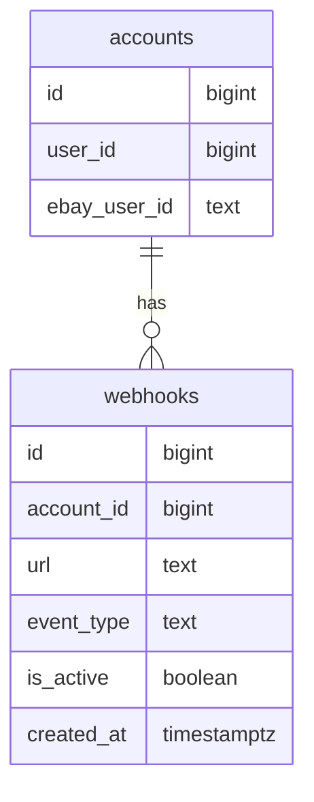

```mermaid
erDiagram
    accounts ||--o{ webhooks : "has"
    accounts {
        id bigint
        user_id bigint
        ebay_user_id text
    }
    webhooks {
        id bigint
        account_id bigint
        url text
        event_type text
        is_active boolean
        created_at timestamptz
    }
```

- `webhooks.account_id` は `accounts.id` を参照し、1アカウントに複数Webhookを登録可能。  
- URLと `event_type` が必須。`is_active` で有効/無効の切り替えを想定。  
