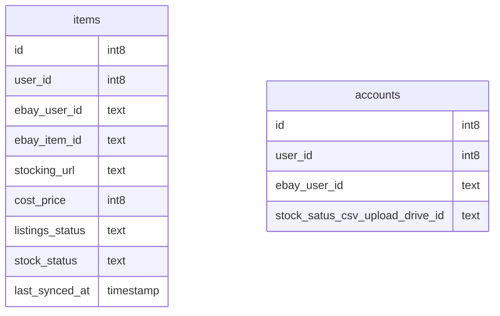

### 各テーブルと関係の説明

- **items**:
  - アイテムは注文に属しています。例えば、商品名、数量、価格などの情報を持ちます。
  - `id`: 本ツール上のアイテムの一意の識別子
  - `user_id`: 本ツール上のユーザーの一意の識別子
  - `ebay_user_id`: ebay上のユーザーの一意の識別子
  - `ebay_item_id`: ebay上のアイテムの一意の識別子（主キー）
  - `stocking_url`: 在庫サイトURL
  - `cost_price`: 在庫サイト上の価格(仕入れ値)
  - `listings_status`: ebay上のステータス
  - `stock_status`: 在庫サイト上のステータス
  - `last_synced_at`: ebay上のステータスと同期した最終更新日
- **accounts**:
  - アイテムは注文に属しています。例えば、商品名、数量、価格などの情報を持ちます。
  - `id`: 本ツール上のアイテムの一意の識別子
  - `user_id`: 本ツール上のユーザーの一意の識別子
  - `ebay_user_id`: ebay上のユーザーの一意の識別子
  - `stock_satus_csv_upload_drive_id`: 在庫確認(スクレイピング)したcsvの出力先ドライブのID